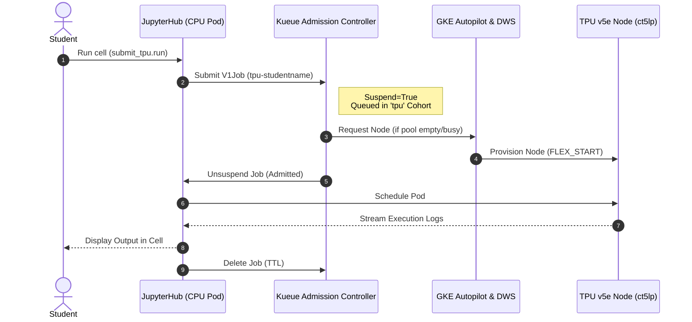
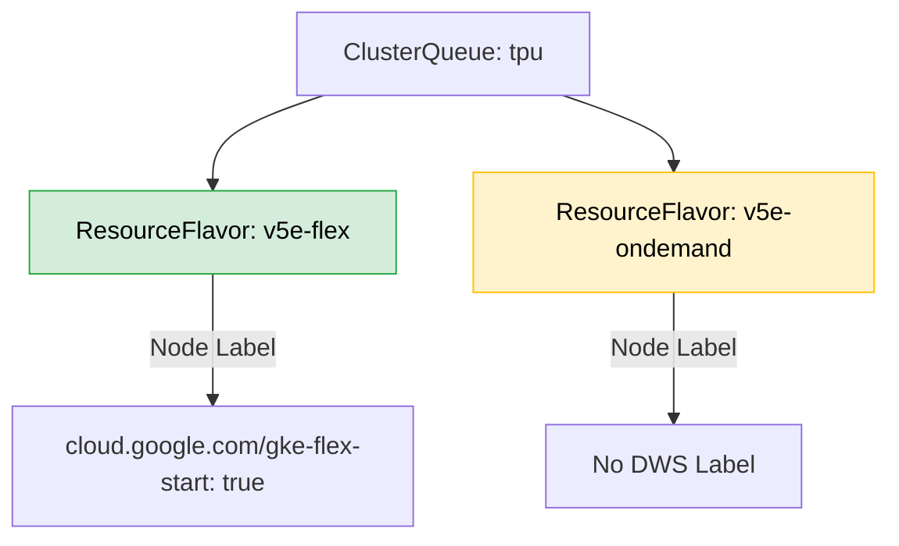

# 🏛️ Architecture: Ephemeral TPU Sharing

This document details the architectural design of the `shared-tpu-notebooks` environment as of the 2026 GKE Autopilot standards.

## The Core Problem

In standard Cloud environments, a Jupyter notebook running on an accelerator node permanently holds that accelerator for as long as the session is active. A Cloud TPU v5e (`ct5lp-hightpu-1t`) costs roughly $1.35/hour. If 300 students keep a tab open to read assignments and occasionally run code, it would cost **$405/hour**, which is prohibitively expensive for a course budget.

## The Solution: Decoupled Job Execution

Instead of providing a TPU to the notebook directly, this architecture decouples the notebook from the hardware.

1. **CPU Notebooks:** Students are given a low-cost Spot CPU notebook (2 vCPU, 8 GiB).
2. **Kueue Scheduling:** Code meant for the TPU is submitted as an ephemeral Kubernetes `Job` via `submit_tpu.py`.
3. **Queue Execution:** `Kueue` (the admission controller) queues these jobs against a shared pool of TPU resources (e.g., 32 or 64 chips).
4. **Scale-to-Zero:** GKE Autopilot provisions TPU nodes from the Dynamic Workload Scheduler (DWS) Flex Pool only when jobs exist, and destroys them after.

---

## 🏗️ System Diagram

The following Mermaid diagram illustrates the data and execution flow when a student submits a TPU job.

## Security Posture (CIS & NIST Guidelines)

Following **NIST SP 800-190** (Application Container Security Guide) and the **CIS GKE Benchmark v1.5.0** (2026):

- **Least Privilege (RBAC):** Students are mapped to a `ServiceAccount` (`student`) restricted to creating/reading Jobs *only* in the `cmu-idl` namespace. They cannot list other students' pods.
- **Identity-Aware Proxy (IAP):** Replaces basic auth. All traffic is zero-trust, authenticated by Google SSO via the GFE (Google Front End).
- **Network Isolation:** `jupyterhub-values.yaml` enforces egress NetworkPolicies. Students can only communicate with the Kubernetes API Server Endpoint (`443`). Egress to `169.254.169.254` (metadata) and internal pod ranges is blocked.
- **Container Sandboxing:** Notebook pods utilize **gVisor** (`runtimeClassName: gvisor`) to strictly isolate untrusted python code from the GKE host kernel. TPU jobs bypass this solely because hardware drivers require host kernel access, but those jobs run transiently as non-root users.

## Queuing Architecture (Multi-Flavor)

Kueue is configured to attempt `FLEX_START` (highly available but zone-specific) first. If the flex pool is exhausted or unsupported in the zone, it falls back to standard on-demand capacity, ensuring seamless class execution.
