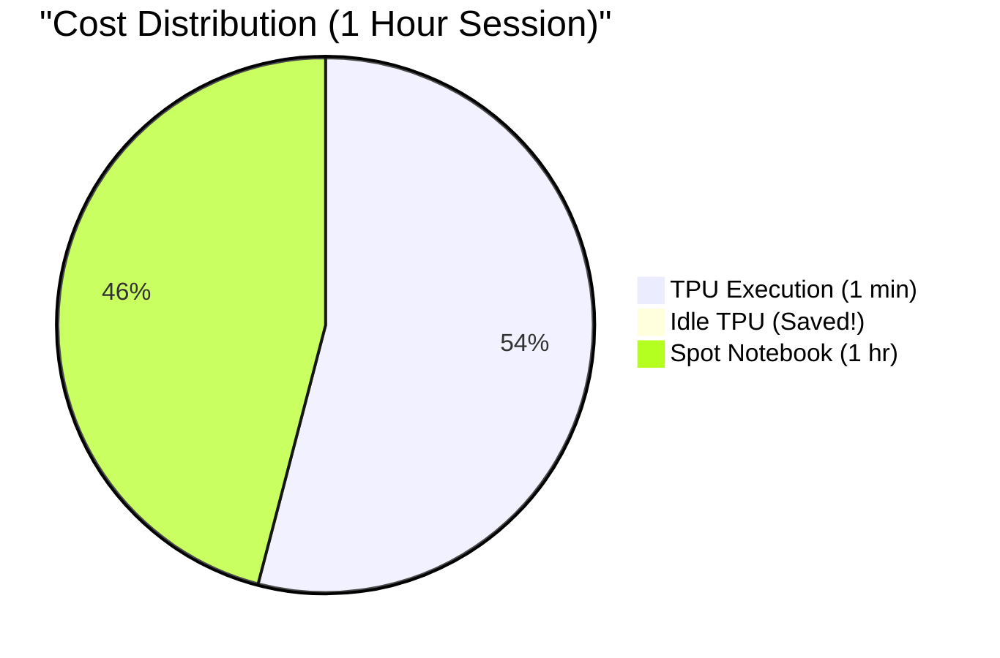

# 💰 Cost Management & Budgeting

Running TPUs for hundreds of students can drain a budget rapidly if mismanaged. This repository is architected to keep costs below **$0.05 per student per session**.

## Where the Money Goes

In a GKE Autopilot cluster, you pay for what pods *request*, not what the underlying VM nodes have.

1. **The Notebook Pod (CPU):** A 2 vCPU, 8 GiB RAM pod.
2. **The TPU Job:** A `ct5lp-hightpu-1t` node carrying 1x v5e chip.
3. **Cluster Management Fee:** $0.10/hour per cluster.

### Spot vs. On-Demand Pricing

We aggressively use Spot VMs for the Jupyter notebooks.

| Resource | On-Demand (Hourly) | Spot (Hourly) | Savings |
| :--- | :--- | :--- | :--- |
| **Notebook (2 vCPU, 8 GiB)** | ~$0.14 | **~$0.017** | ~88% |
| **TPU v5e Chip** | $1.20 | $0.36 | ~70% |

*Note: The TPU pool defaults to On-Demand via DWS Flex because Spot TPUs can be preempted mid-execution, frustrating students. Notebooks, however, can handle preemption transparently since data is backed by Persistent Volumes.*

## Automated Cost-Saving Mechanisms

### 1. Idle Culler

Students frequently forget to close browser tabs. The `jupyterhub-values.yaml` is configured with an aggressive culler:

```yaml
cull:
  enabled: true
  timeout: 3600    # Cull if idle for 60 minutes
  every: 300       # Check every 5 minutes
  maxAge: 28800    # Hard kill after 8 hours, even if active
```

### 2. Ephemeral TPU Execution

Because TPUs are invoked via the `submit_tpu.run()` Python client, the student only bills the TPU for the *exact seconds* their matrix multiplication is running.


*(Y-axis is in cents)*

### 3. The Warm Pool Guardrail

Instructors can hold a "warm" TPU node via `make warm-on WARM=1` to prevent cold-starts during a live lecture. Because a warm node bills $1.35/hour constantly, we have a failsafe:

The `tpu-warm-pool.yaml` manifest includes a `CronJob` that executes `kubectl scale deployment tpu-warm-pool --replicas=0` every day at **22:00 UTC**. If you forget to run `make warm-off`, the cluster shuts it off for you.

## End of Term Cleanup

Persistent Volumes (student home directories) bill perpetually until deleted. To stop all billing at the end of the term:

```bash
# Preview what will be deleted
make clean-pvcs-dry-run

# Execute the deletion
make clean-pvcs

# Destroy the cluster completely
make teardown
```
