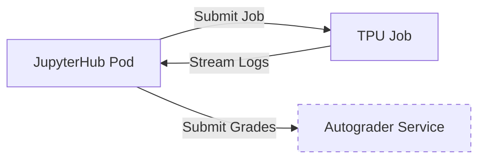

# 🛠️ Developer Guide

This guide is for teaching assistants, instructors, or system administrators who need to modify the codebase, adjust logic, or upgrade components.

## Directory Structure & Responsibilities

- **`docker/`**: Contains the Dockerfile and Python requirements. This image runs *both* the Jupyter Notebook environment and the TPU execution environment. 
- **`k8s/`**: Kubernetes YAML manifests. Changes to security, quotas, and hub configuration happen here.
- **`notebooks/`**: The Python client (`submit_tpu.py`) that students use to queue jobs.
- **`scripts/`**: Bash utilities and python benchmarking scripts. **All scripts use `common.sh` for standardized logging and error handling.**

## Modifying the Bash Scripts

We strictly enforce 2026 bash standards. When writing or editing scripts in `scripts/`:

1. **Always source `common.sh`**:
   ```bash
   source "$(dirname "${BASH_SOURCE[0]}")/common.sh"
   ```
2. **Use strict mode**: `set -euo pipefail` is mandatory.
3. **Use log functions**: Do not use `echo`. Use `log_info`, `log_success`, `log_warn`, and `log_error`.
4. **Use Docstrings**: Every bash script must start with a descriptive header block explaining its inputs, outputs, and side effects.

## Modifying the Python Client (`submit_tpu.py`)

If you add parameters to `submit_tpu.run()`:
1. Ensure full type hints are provided.
2. Update the Google-style docstrings.
3. **Never** modify the Job spec to request privileges (`run_as_root`, `privileged: true`). GKE Autopilot's mutating admission webhook will reject it immediately.

## Upgrading the JupyterHub Helm Chart

To bump the JupyterHub version:
1. Modify `scripts/03_deploy_hub.sh`.
2. Update the `--version` flag in the `helm upgrade` command.
3. Review the Zero-to-JupyterHub changelog, particularly around `singleuser.networkPolicy` and `Authenticator` configurations, as these frequently contain breaking changes.

## Adding New Subsystems

### System Diagram Context

When adding new components (e.g., a grading service), consider how it interacts with the existing flow:



Ensure the grading service runs in the `cmu-idl` namespace and its `NetworkPolicy` allows ingress from the Hub pods.
